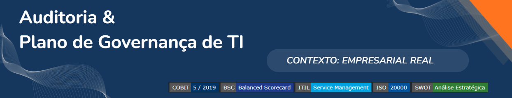
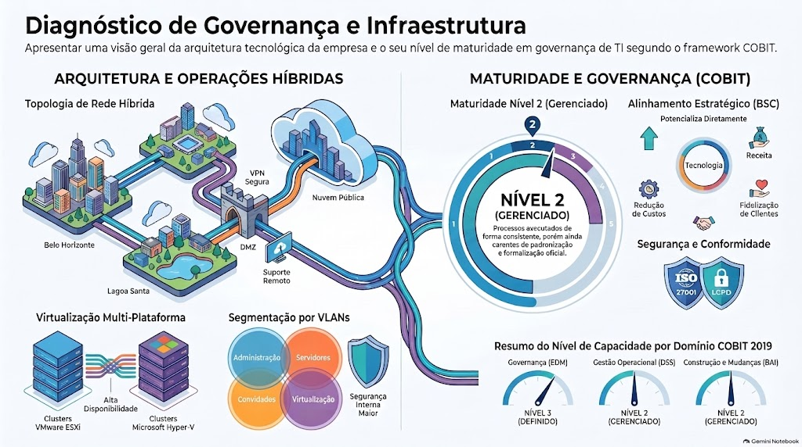

### Auditoria e Plano de Governança de TI e GRC

  

Avaliação de maturidade, diagnóstico estratégico e construção de Business Case para estruturação de governança, riscos e conformidade em empresa de serviços de TI.

#### **Natureza:** Acadêmico / Empresarial Real ✔

---

## Visão Geral

Este projeto consistiu em um diagnóstico completo da maturidade de Governança de TI e GRC de uma empresa real de serviços de tecnologia. O trabalho envolveu o levantamento de ativos, alinhamento estratégico via Balanced Scorecard (BSC), avaliação de maturidade de processos baseada no COBIT 5/2019 e a elaboração de um Business Case detalhado para justificar e planejar a implantação de um modelo de governança estruturado.

## Contexto e Problema

A organização, apesar de possuir uma base técnica sólida e forte alinhamento operacional, operava com processos de governança empíricos. Havia ausência de políticas formais, indicadores de desempenho padronizados e mecanismos sistemáticos de gestão de riscos e conformidade. Essa lacuna, somada à alta dependência de poucos colaboradores-chave, limitava a escalabilidade do negócio e a segurança das informações dos clientes.

## Objetivos

- Avaliar a maturidade dos processos de TI utilizando o framework COBIT 5/2019.
- Alinhar os objetivos de TI aos objetivos corporativos utilizando o Balanced Scorecard (BSC).
- Identificar gaps de governança, riscos e conformidade através de análise SWOT e levantamento da "voz do cliente".
- Elaborar um Business Case detalhado para justificar o investimento na implantação de Governança de TI e GRC.

## Escopo

**Inclusões:** Infraestrutura de TI (unidades matriz e filial), virtualização, cloud, processos de suporte e governança, análise estratégica e projeções financeiras.  
**Exclusões:** Implementação técnica das soluções propostas (o projeto entregou o plano e o business case) e expansão física para novas localidades.  
**Limites:** Projeto acadêmico com prazo definido, baseado em dados coletados junto à gestão da empresa e validados em ambiente controlado.

## Papel e Responsabilidades

Atuação na condução da avaliação de maturidade dos processos (COBIT), elaboração da análise SWOT, estruturação do alinhamento estratégico (BSC) e desenvolvimento do Business Case, incluindo estimativas de investimentos, custos e projeção de benefícios.

## Metodologia e Abordagem

O projeto foi conduzido em fases estruturadas:
1. **Levantamento de Dados:** Inventário de ativos de hardware, software e topologia de rede.
2. **Alinhamento Estratégico:** Mapeamento de objetivos corporativos e de TI utilizando o Balanced Scorecard (BSC).
3. **Avaliação de Maturidade:** Aplicação do modelo de avaliação de capacidade de processos do COBIT 5, definindo níveis alvo e atuais (escala 0 a 5).
4. **Análise de Gaps:** Realização de Análise SWOT e levantamento de reclamações e sugestões de clientes internos/externos.
5. **Business Case:** Estruturação de investimentos, custos, benefícios esperados, riscos e indicadores de monitoramento (KPIs).

## Frameworks e Boas Práticas

- **COBIT 5/2019:** Utilizado para avaliar a capacidade dos processos de TI (domínios EDM, APO, BAI, DSS, MEA) e definir níveis de maturidade alvo.
- **Balanced Scorecard (BSC):** Aplicado para conectar os objetivos de TI às perspectivas Financeira, Clientes, Processos Internos e Aprendizado e Crescimento.
- **ITIL e ISO 20000:** Utilizados como referências para as boas práticas de gestão de serviços e processos de suporte.
- **SWOT:** Utilizado para o diagnóstico estratégico do ambiente de governança atual.

## Tecnologias e Ferramentas

- **Modelagem e Gestão:** Ferramentas de modelagem de processos, planilhas para avaliação de maturidade COBIT e projeções financeiras.
- **Infraestrutura Analisada:** Ambientes virtualizados (VMware/Hyper-V), Cloud (OVH), Firewalls, Active Directory.

## Solução e Arquitetura

A solução entregue foi um modelo de governança sob medida para uma PME de serviços de TI. A arquitetura do plano propõe a transição de processos predominantemente no Nível 1 e 2 de maturidade (Executado/Gerenciado) para o Nível 3 (Definido), através da formalização de políticas, implementação de um Service Desk com SLAs e estruturação de controles de segurança e continuidade.

## Evidências e Entregáveis

- **Inventário de Ativos e Topologia:** Mapeamento detalhado da infraestrutura das unidades.
- **Matriz de Alinhamento Estratégico (BSC):** Tabela conectando objetivos de negócio a iniciativas de TI.
- **Avaliação de Maturidade COBIT:** Tabela detalhada com o nível atual e nível alvo para 37 processos de TI.
- **Análise SWOT e Voz do Cliente:** Diagnóstico de forças, fraquezas, oportunidades e ameaças da governança atual.
- **Business Case Completo:** Documento com estimativa de investimento inicial (R$ 29.000), custos mensais, benefícios projetados e matriz de riscos.

*[Espaço reservado para inserção de imagens da Matriz BSC, Tabela de Maturidade COBIT ou Gráfico do Business Case]*

 

## Resultados e Validação

- Diagnóstico preciso da maturidade atual da organização, identificando que a maioria dos processos críticos estava nos níveis 1 e 2.
- Definição clara de níveis alvo (Nível 3) para processos de Governança (EDM), Segurança (APO13) e Suporte (DSS).
- **Projeções do Business Case:** O plano estruturado estimou uma redução de até 30% no tempo de resolução de chamados e um aumento de 20% na retenção de clientes através da formalização de SLAs e contratos.
- Aprovação do plano pela gestão como roteiro estratégico para a evolução da maturidade organizacional.

## Aprendizados e Limitações

- **Aprendizado:** A aplicação do COBIT em PMEs exige adaptação; focar em processos de alto valor (como Segurança e Gestão de Incidentes) gera resultados mais rápidos do que tentar implementar todos os processos simultaneamente.
- **Limitação:** As métricas de benefícios (redução de tempo, aumento de retenção) são projeções baseadas em benchmarks de mercado e no julgamento da gestão, não em dados históricos pós-implementação.

---

## 📂 Documentação, Evidências e Recursos

- [Documentação Técnica Completa (PDF)](docs/relcpl.pdf)
- [Link para o Relatório Completo de Auditoria e Governança (PDF Sanitizado)](docs/relcpl.pdf)
- [Planilha de Avaliação de Maturidade COBIT 2019](docs/cobit2019.pdf)
- [Planilha de Avaliação de Maturidade COBIT 5](docs/cobit5.pdf)
- [Projeções Financeiras](docs/financeiro.pdf)
- [Link para o Business Case](docs/xxxxxxxxxxxxxxxxxxxxxxxxxxxx.pdf)

## Contato

---

## 🧭 Navegação do Portfólio

[⬅️ Voltar ao Perfil Principal](https://github.com/mighcruz) 

[📂 Voltar ao Hub Central de Projetos](https://github.com/mighcruz/portfolio-ti)

---

###### 🔒 Nota de Confidencialidade

###### *Tratando-se de um projeto desenvolvido em ambiente de simulação corporativa e laboratório de testes, quaisquer topologias de rede, endereços IP, credenciais de acesso ou configurações específicas mencionadas na documentação original foram omitidas ou sanitizadas neste repositório, preservando as boas práticas de segurança da informação.*
